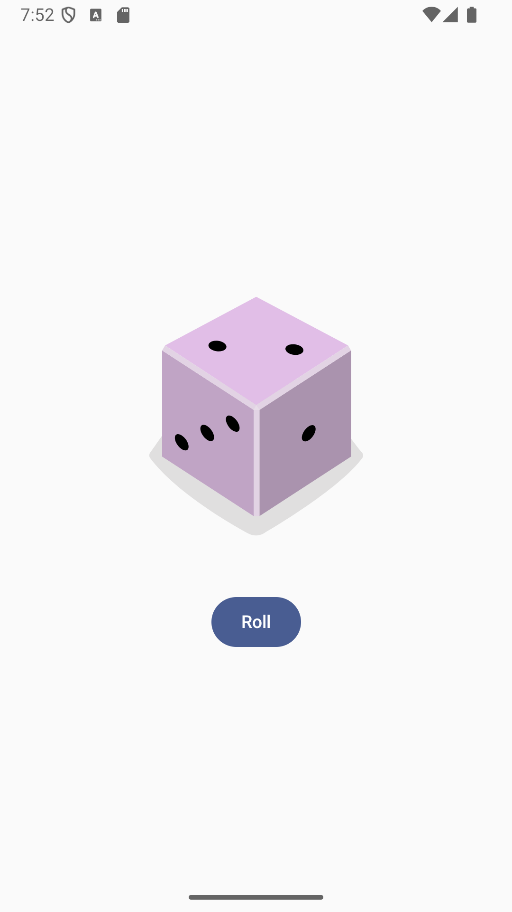

## Dice Roller - Бросок костей

Простое и элегантное Android-приложение для броска игральных костей, созданное с использованием Jetpack Compose.

### 📸 Скриншоты

<div align="center">
  
</div>

### ✨ Особенности

- 🎯 Простой и интуитивно понятный интерфейс
- 🎨 Современный дизайн с Jetpack Compose
- ⚡ Быстрая и плавная работа

### 🛠 Технологии

- **Kotlin** - Язык программирования
- **Jetpack Compose** - Modern UI toolkit
- **Material Design 3** - Система дизайна
- **Android Studio** - Среда разработки

### 📦 Установка

1. **Клонируйте репозиторий:**
   ```bash
   git clone https://github.com/your-username/DiceRoller.git
Откройте проект в Android Studio

Запустите на эмуляторе или физическом устройстве

### 🚀 Как использовать
Нажмите кнопку "Roll"

Смотрите результат на изображении кости

Повторяйте для нового броска!

### 🏗 Архитектура и ключевые концепции
Приложение демонстрирует лучшие практики Jetpack Compose:

Использование remember для сохранения состояния:
```kotlin
var result by remember { mutableStateOf(1) }
Компонуемые функции:
```kotlin
@Composable
fun DiceWithButtonAndImage() {
    // Состояние и логика
}

```kotlin
// Material Design 3 компоненты
Button(onClick = { result = (1..6).random() }) {
    Text(stringResource(R.string.roll))
}
